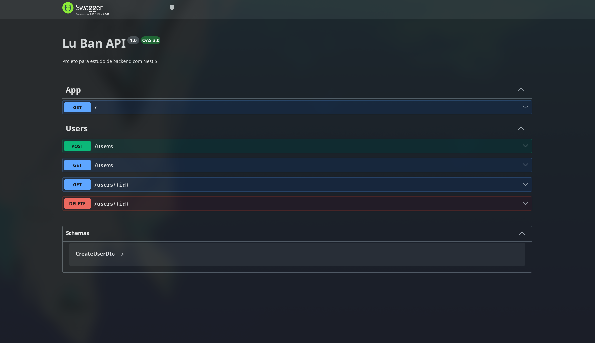

<p align="center">
  <a href="http://nestjs.com/" target="blank"></a>
</p>

<h1 align="center">Back N' Nest</h1>

<p align="center">
  Projeto para estudo do ecossistema backend typescript
</p>

<p align="center">
  <a href="https://www.npmjs.com/~nestjscore" target="_blank"></a>
  <a href="https://www.npmjs.com/~nestjscore" target="_blank"></a>
  <a href="https://www.npmjs.com/~nestjscore" target="_blank"></a>
</p>



---

## Sobre

**Back N' Nest** é um projeto para desenvolvimento pessoal e profissional de vários ecossistemas do campo backend e typescript com base numa API de usuários.

Com seus primeiro passo sendo uma API RESTful para CRUD de usuários, desenvolvida com boas práticas de arquitetura e design de software. O projeto utiliza NestJS como framework, Prisma como ORM e SQLite como banco de dados, com documentação Swagger integrada.

## Funcionalidades

- **CRUD de Usuários** — Criar, listar, buscar e deletar usuários
- **Validação de Dados** — Validação automática dos campos de entrada via `class-validator`
- **Tratamento de Erros** — Exceções HTTP adequadas (`ConflictException`, `NotFoundException`)
- **Documentação Swagger** — Interface interativa de documentação da API disponível em `/docs`
- **Banco de Dados SQLite** — Persistência local com Prisma + adapter LibSQL
- **Testes E2E** — Cobertura de testes de ponta a ponta com Supertest

## Stack

| Tecnologia | Versão | Descrição |
|------------|--------|-----------|
| [NestJS](https://nestjs.com/) | v11 | Framework Node.js para aplicações server-side |
| [TypeScript](https://www.typescriptlang.org/) | v5.9 | Tipagem estática para JavaScript |
| [Prisma](https://www.prisma.io/) | v7.5 | ORM moderno e type-safe |
| [SQLite](https://www.sqlite.org/) | — | Banco de dados leve e serverless |
| [Swagger](https://swagger.io/) | — | Documentação OpenAPI da API |
| [Jest](https://jestjs.io/) | v30 | Framework de testes |
| [Supertest](https://github.com/visionmedia/supertest) | v7 | Testes HTTP/E2E |
| [ESLint](https://eslint.org/) | v9 | Linter para manter qualidade de código |
| [Prettier](https://prettier.io/) | — | Formatador de código |

## Estrutura do Projeto

```
src/
├── prisma/
│   ├── prisma.module.ts        # Módulo global do Prisma
│   └── prisma.service.ts       # Serviço de conexão com o banco
├── users/
│   ├── dto/
│   │   ├── create-user.dto.ts  # DTO para criação de usuário
│   │   └── user-response.dto.ts # DTO de resposta do usuário
│   ├── user.module.ts          # Módulo de usuários
│   ├── users.controller.ts     # Controller com endpoints REST
│   └── users.service.ts        # Lógica de negócio dos usuários
├── app.module.ts               # Módulo raiz da aplicação
├── app.controller.ts           # Controller principal (health check)
├── app.service.ts              # Serviço principal
└── main.ts                     # Ponto de entrada da aplicação
```

## Endpoints

| Método | Rota | Descrição | Status Code |
|--------|------|-----------|-------------|
| `GET` | `/` | Health check | `200` |
| `POST` | `/users` | Criar um novo usuário | `201` |
| `GET` | `/users` | Listar todos os usuários | `200` |
| `GET` | `/users/:id` | Buscar usuário por ID | `200` |
| `DELETE` | `/users/:id` | Deletar usuário por ID | `204` |

## Modelo de Dados

```prisma
model User {
  id        Int      @id @default(autoincrement())
  name      String
  email     String   @unique
  password  String
  createdAt DateTime @default(now())
  updatedAt DateTime @updatedAt
}
```

## Pré-requisitos

- [Node.js](https://nodejs.org/) v18 ou superior
- npm ou yarn

## Instalação

```bash
# Clonar o repositório
git clone https://github.com/eddiewav/user_api_nestjs.git
cd user_api_nestjs

# Instalar dependências
npm install

# Gerar cliente do Prisma
npx prisma generate

# Executar migrações do banco de dados
npm run db:migrate
```

## Configuração

O projeto utiliza SQLite local. Crie um arquivo `.env` na raiz do projeto:

```env
DATABASE_URL="file:./dev.db"
PORT=3000
```

Para testes E2E, o arquivo `.env.test` já está configurado:

```env
DATABASE_URL="file:./test.db"
```

## Uso

```bash
# Desenvolvimento (com hot reload)
npm run dev

# Build de produção
npm run build

# Iniciar em produção
npm run start:prod
```

A API estará disponível em `http://localhost:3000`. A documentação Swagger está disponível em `http://localhost:3000/docs`.

## Comandos Disponíveis

| Comando | Descrição |
|---------|-----------|
| `npm run dev` | Inicia o servidor em modo de desenvolvimento |
| `npm run build` | Gera o build de produção |
| `npm run start` | Inicia a aplicação em produção |
| `npm run start:debug` | Inicia em modo debug |
| `npm run lint` | Roda o ESLint com auto-fix |
| `npm run format` | Formata o código com Prettier |
| `npm run test` | Executa os testes unitários |
| `npm run test:cov` | Executa testes com cobertura |
| `npm run test:e2e` | Executa testes end-to-end |
| `npm run db:migrate` | Roda as migrações do Prisma |
| `npm run db:studio` | Abre o Prisma Studio (GUI do banco) |
| `npm run db:reset` | Reseta o banco de dados |

## Testes

```bash
# Testes unitários
npm run test

# Testes com cobertura
npm run test:cov

# Testes E2E
npm run test:e2e
```

## Licença

Este projeto está sob a licença MIT. Veja o arquivo [LICENSE](LICENSE) para mais detalhes.
